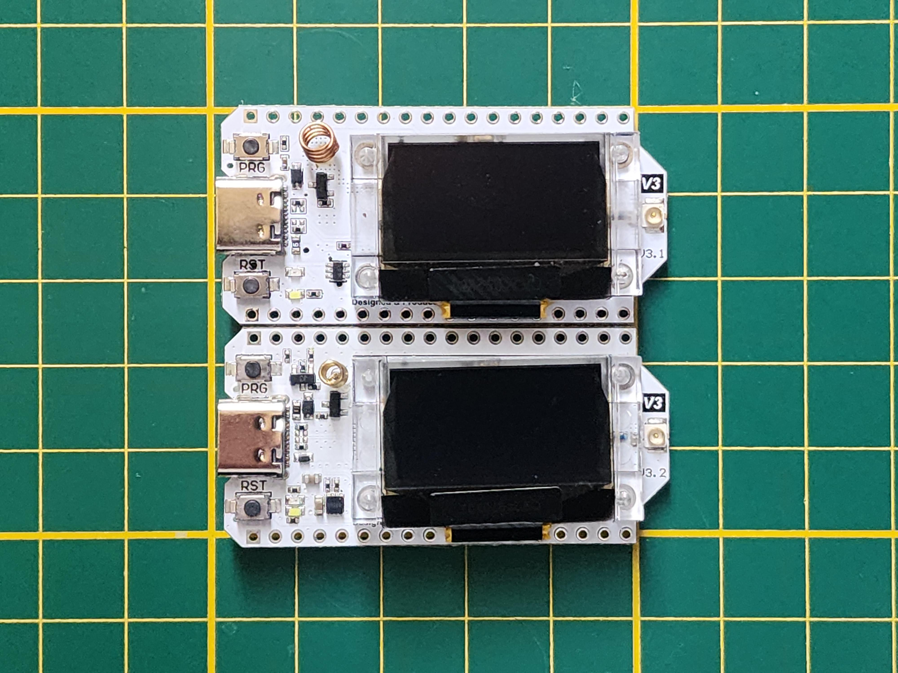

# How to get started
*An easy beginners guide to the Welsh mesh*

---

!!! info "Information"
    This website is very beta. Many pages are broken or they just don't exist. Please be patient, I am only one person. Thanks!

## 1. Recommended Hardware
To join you will need a small, cheap, **Long Range** radio that will join into the mesh. We recommend the following starter devices:

| Device | Use Case | Approx Price |
| :--- | :--- | :--- |
| **Heltec V3** | Best starter node (USB powered) | £20 |
| **RAK WisBlock** | Best for Solar/Outdoor nodes | £40 |
| **T-Beam** | Great for GPS tracking | £35 |

## 2. Assemble your device
Once you receive your device, you will probably need to assemble it. If you don't, continue to Part 3.

{ width="70%" }

Each device will have its own way to assemble it. You may need to search up your specific board; below are some recommended tutorials.

!!! note "Note"
    Some devices may need specific assembly instructions; these are **generic tutorials** pointed to the most popular devices.

| Video/Search | About | From |
| :--- | :--- | :--- |
| [**Heltec V3**](https://www.youtube.com/watch?v=OydhGl0hiEY) | A video to help assemble the Heltec V3 | YouTube |
| [**LilyGo T-Echo**](https://www.google.com/search?q=How+to+setup+the+LilyGo+T-Echo) | A search to help find setups for the T-Echo | Google |
| [**RAK WisBlock**](https://www.google.com/search?q=How+to+assemble+RAK+WisBlock) | A search to help setup the RAK WisBlock | Google |

!!! warning "Warning"
    **Do not ever power on your device without the antenna. Doing so can cause the radio chip to overheat and fry itself.**

## 3. Flash your device
Now, once you have everything assembled, you need to flash it with Meshtastic Firmware.

[Go to Meshtastic Flasher](https://flasher.meshtastic.org/){ .md-button .md-button--primary }

Visit the Meshtastic Web Flasher, then follow the numbered instructions below:

1. Choose your Device.
2. Choose your Firmware (Stable / Beta Recommended).
3. Click **Flash**, **Continue**, **Full Erase and Install**.
4. Select your device.
5. Wait...
6. Once the text says "Leaving..." you are done!

You are now ready to connect to your new node and join the mesh!

[Go to Node Configuration](node-settings.md){ .md-button .md-button--primary }